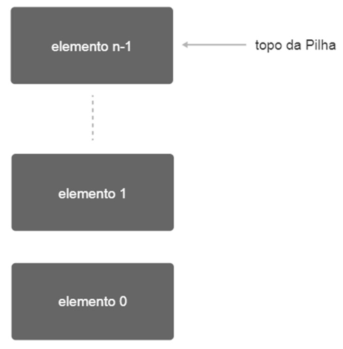

    
[`main`](https://github.com/LoriaLawrenceZ/FIAP-2ESOA-F2/tree/main) | [`cap-1`](https://github.com/LoriaLawrenceZ/FIAP-2ESOA-F2/tree/cap-1) | [`cap-2`](https://github.com/LoriaLawrenceZ/FIAP-2ESOA-F2/tree/cap-2) | [`cap-3`](https://github.com/LoriaLawrenceZ/FIAP-2ESOA-F2/tree/cap-3) | [`cap-4`](https://github.com/LoriaLawrenceZ/FIAP-2ESOA-F2/tree/cap-4) | [`cap-5`](https://github.com/LoriaLawrenceZ/FIAP-2ESOA-F2/tree/cap-5) | [`cap-6`](https://github.com/LoriaLawrenceZ/FIAP-2ESOA-F2/tree/cap-6) | [`cap-7`](https://github.com/LoriaLawrenceZ/FIAP-2ESOA-F2/tree/cap-7) | [`cap-8`](https://github.com/LoriaLawrenceZ/FIAP-2ESOA-F2/tree/cap-8) | [`cap-9`](https://github.com/LoriaLawrenceZ/FIAP-2ESOA-F2/tree/cap-9)

    <h1 align=center>CAPÍTULO 5</h1>

>**Capítulo 5 - Laboratório de Listas Lineares, Pilhas e Filas**

---

    
📌 Índice

- [LISTAS LINEARES ESPECIAIS: PILHAS ENCADEADAS](#listas-lineares-especiais-pilhas-encadeadas)

---

# LISTAS LINEARES ESPECIAIS: PILHAS ENCADEADAS

Uma pilha (*stack*) é uma lista linear, e nela, as operações de inserção e remoção são efetuadas em apenas uma extremidade, denominada **topo da pilha**. Estruturas deste tipo são conhecidas como ***LIFO*** (*Last In, First Out*).

Quando definido um tipo de dado, é definido, além dos valores que podem ser armazenados por esse tipo, as operações que esses valores poderão sofrer. Em relação aos valores que podem ser armazenados no tipo de dado PILHA, depende do tipo de dado que se deseja armazenar como elemento da pilha, o que depende da aplicação para qual estamos usando o tipo de dado pilha.

As operações do tipo de dado PILHA são definidas as seguintes:

> [!NOTE]
>
> ***BÁSICAS***
>
> | Operação | Descrição |
> | :--- | :--- |
> | **PUSH(P, v)** | Armazena (empurra) na extremidade conhecida como topo da pilha P o elemento com valor **v**, aumentando o tamanho da pilha. |
> | **POP(P, v)** | retira do topo (desempilha) da pilha P o elemento e armazena o valor do elemento **v**, diminuindo a pilha. |
> | **TOP(P, v)** | Lê o elemento que está no topo da pilha P e armazena o valor do elemento em **v**. |

> [!NOTE]
>
> ***AUXILIARES***
>
> | Operação | Descrição |
> | :--- | :--- |
> | **INIT(P)** | Inicia a pilha deixando-a vazia. |
> | **IsEmpty(P)** | Verifica se a pilha P está vazia, retornando verdade se a pilha estiver vazia e falso, caso contrário. |
> | **IsFull(P)** | Verifica se a pilha P está cheia, retornando verdade se a pilha estiver cheia e falso, caso contrário. |

(<a href="#readme-top">back to top</a>)

(<a href="#readme-top">back to top</a>)

(<a href="#readme-top">back to top</a>)

(<a href="#readme-top">back to top</a>)

(<a href="#readme-top">back to top</a>)

(<a href="#readme-top">back to top</a>)

(<a href="#readme-top">back to top</a>)

(<a href="#readme-top">back to top</a>)

(<a href="#readme-top">back to top</a>)

(<a href="#readme-top">back to top</a>)

(<a href="#readme-top">back to top</a>)

(<a href="#readme-top">back to top</a>)

(<a href="#readme-top">back to top</a>)

(<a href="#readme-top">back to top</a>)

(<a href="#readme-top">back to top</a>)

(<a href="#readme-top">back to top</a>)

